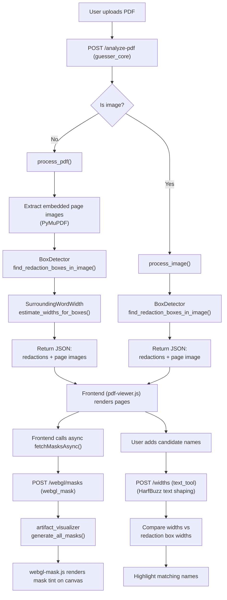

# Epstein Unredactor — Architecture Overview

A Django web application that analyzes scanned PDF documents to detect black redaction bars, measures their pixel widths, and helps users identify which names could fit under each redaction by matching text widths. The project uses a "Core + Plugin" architecture with a declarative tool registry to isolate features into independent Django apps.

## Technology Stack

| Layer | Technology | Purpose |
|-------|-----------|---------|
| **Web framework** | Django 6.0 | URL routing, template rendering, API views |
| **PDF parsing** | PyMuPDF (fitz) | Extract embedded images and text spans from PDFs |
| **Image analysis** | OpenCV + NumPy | Detect black rectangular redaction boxes in page images |
| **Text shaping** | uHarfBuzz (+ Pillow fallback) | Measure precise pixel widths of candidate names accounting for kerning and ligatures |
| **Mask generation** | Pillow + NumPy | Create grayscale mask PNGs marking redacted regions |
| **Frontend rendering** | Vanilla JS, Fabric.js, WebGL | PDF page display, text overlays, GPU-accelerated mask tinting |
| **Production server** | Gunicorn + Nginx | WSGI app server behind a reverse proxy with SSL |

## Directory Structure

```
EpsteinTool/
├── manage.py                       # Django entry point
├── requirements.txt                # Python dependencies
├── setup.sh                        # Production server setup (Linux)
├── run_app.sh / run_app.bat        # Local dev launchers
│
├── epstein_project/                # Django project config
│   ├── settings.py                 # INSTALLED_APPS (core + dynamic plugin discovery)
│   ├── urls.py                     # Auto-discovers routes via registry + AppConfig
│   ├── wsgi.py / asgi.py
│
├── guesser_core/                   # Core App (Base Viewer & Redaction Processing)
│   ├── base.py                     # PDFTool base class (all plugins inherit from this)
│   ├── registry.py                 # PDFToolRegistry + @register_tool decorator
│   ├── views.py                    # Root /, /analyze-pdf
│   ├── urls.py
│   ├── logic/
│   │   ├── BoxDetector.py          # Row-scan black box detection
│   │   ├── SurroundingWordWidth.py # Refine box edges using nearby text positions
│   │   ├── ProcessRedactions.py    # Orchestrator: PDF → boxes → refined redactions
│   │   └── masking.py              # Shared mask generation (used by tesseract_ocr)
│   ├── templates/                  # Base index.html (iterates registry for plugins)
│   └── static/guesser_core/        # Base UI JS (pdf-viewer.js, app.js, state.js)
│
├── text_tool/                      # Plugin App (Font logic & Typography)
│   ├── tool.py                     # TextTool(PDFTool) — registered via @register_tool
│   ├── apps.py                     # ready() imports tool.py
│   ├── views.py                    # /widths, /fonts-list
│   ├── urls.py
│   ├── logic/
│   │   ├── width_calculator.py     # HarfBuzz width measurement
│   │   └── extract_fonts.py        # Dominant font detection
│   ├── templates/                  # Toolbars injected via registry
│   └── static/text_tool/           # unified-text-box.js, svg-renderer.js, etc.
│
├── webgl_mask/                     # Plugin App (Visual GPU Masks)
│   ├── tool.py                     # WebglMaskTool(PDFTool)
│   ├── apps.py
│   ├── views.py                    # /webgl/masks
│   ├── urls.py
│   ├── logic/
│   │   └── artifact_visualizer.py  # OpenCV -> grayscale mask PNG generator
│   ├── templates/                  # Toolbars injected via registry
│   └── static/webgl_mask/          # webgl-mask.js (WebGL renderer)
│
├── tesseract_ocr/                  # Plugin App (OCR via Tesseract)
│   ├── tool.py                     # TesseractOcrTool(PDFTool)
│   ├── apps.py
│   ├── views.py                    # /tesseract-ocr/run-ocr
│   ├── urls.py
│   └── logic/
│       └── tesseract_runner.py     # Tesseract OCR execution
│
├── redaction_matching/             # Plugin App (AI Sidebar Tools)
│   ├── tool.py                     # RedactionMatchingTool(PDFTool)
│   ├── apps.py
│   ├── templates/                  # sidebar_tools.html, toolbar_button.html
│   └── static/redaction_matching/  # api.js, styles.css
│
├── embedded_text_viewer/           # Plugin App (Legacy Inline Text Overlay)
│   ├── tool.py                     # EmbeddedTextViewerTool(PDFTool)
│   ├── apps.py
│   ├── views.py                    # /embedded-text-viewer/api/extract-spans
│   ├── urls.py
│   ├── templates/                  # Toolbar link and options bar
│   └── static/embedded_text_viewer/
│
├── extracted_text/                  # Backend-only App (no PDFTool, no UI)
│   ├── apps.py                     # AppConfig with url_prefix/url_module
│   ├── views.py
│   └── urls.py
│
├── assets/
│   ├── fonts/                      # .ttf font files for width calculation
│   ├── names/                      # Pre-built candidate name lists
│   └── pdfs/                       # Sample PDF documents
│
├── guide/                          # Documentation (you are here)
└── tests/                          # Test scripts
```

## Data Flow



## Module Dependencies

```mermaid
graph TD
    subgraph "Django Project"
        urls["epstein_project/urls.py"]
    end

    subgraph "guesser_core (Core App)"
        REG["registry.py\n@register_tool"]
        BASE["base.py\nPDFTool"]
        PR["ProcessRedactions.py"]
        BD["BoxDetector.py"]
        SW["SurroundingWordWidth.py"]
        MASK["masking.py"]
        core_views["views.py"]
        HTML["index.html"]
        APP["app.js / pdf-viewer.js"]
    end

    subgraph "webgl_mask (Plugin)"
        WGL_TOOL["tool.py\nWebglMaskTool"]
        WGL_V["views.py"]
        AV["artifact_visualizer.py"]
        WGL_JS["webgl-mask.js"]
    end

    subgraph "text_tool (Plugin)"
        TXT_TOOL["tool.py\nTextTool"]
        TXT_V["views.py"]
        WC["width_calculator.py"]
        TXT_JS["text-tool.js"]
    end

    subgraph "tesseract_ocr (Plugin)"
        OCR_TOOL["tool.py\nTesseractOcrTool"]
        OCR_V["views.py"]
        TR["tesseract_runner.py"]
    end

    subgraph "redaction_matching (Plugin)"
        RM_TOOL["tool.py\nRedactionMatchingTool"]
        RM_JS["api.js"]
    end

    subgraph "extracted_text (Backend-only)"
        ET_V["views.py"]
    end

    %% Registration flow
    BASE -.->|"inherits"| WGL_TOOL
    BASE -.->|"inherits"| TXT_TOOL
    BASE -.->|"inherits"| OCR_TOOL
    BASE -.->|"inherits"| RM_TOOL
    WGL_TOOL -->|"@register_tool"| REG
    TXT_TOOL -->|"@register_tool"| REG
    OCR_TOOL -->|"@register_tool"| REG
    RM_TOOL -->|"@register_tool"| REG

    %% URL routing
    urls -->|"registry"| REG
    urls --> core_views
    urls --> ET_V

    %% Core dependencies
    core_views --> PR
    PR --> BD
    PR --> SW
    core_views -->|"get_tools()"| REG
    HTML -.->|"iterates registry"| REG

    %% Plugin backends
    WGL_V --> AV
    AV -.->|"reads from core"| BD
    TXT_V --> WC
    OCR_V --> TR
    TR -.->|"uses"| MASK
```


