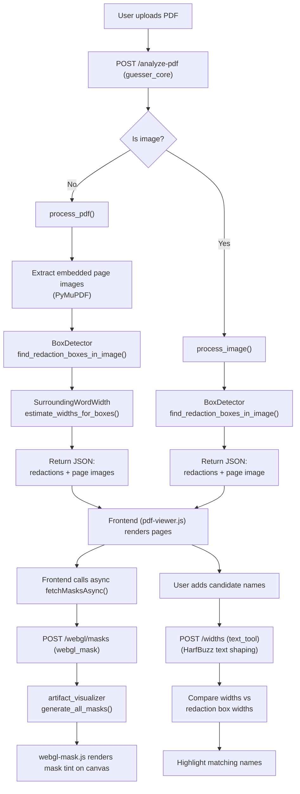
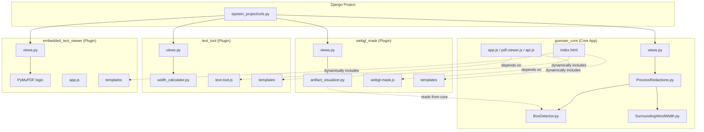

# Epstein Unredactor — Architecture Overview

A Django web application that analyzes scanned PDF documents to detect black redaction bars, measures their pixel widths, and helps users identify which names could fit under each redaction by matching text widths. The project uses a multi-app "Plugin" architecture to isolate different features.

## Technology Stack

| Layer | Technology | Purpose |
|-------|-----------|---------|
| **Web framework** | Django 6.0 | URL routing, template rendering, API views |
| **PDF parsing** | PyMuPDF (fitz) | Extract embedded images and text spans from PDFs |
| **Image analysis** | OpenCV + NumPy | Detect black rectangular redaction boxes in page images |
| **Text shaping** | uHarfBuzz (+ Pillow fallback) | Measure precise pixel widths of candidate names accounting for kerning and ligatures |
| **Mask generation** | Pillow + NumPy | Create grayscale mask PNGs marking redacted regions |
| **Frontend rendering** | Vanilla JS, Fabric.js, WebGL | PDF page display, text overlays, GPU-accelerated mask tinting |
| **Production server** | Gunicorn + Nginx | WSGI app server behind a reverse proxy with SSL |

## Directory Structure

```
EpsteinTool/
├── manage.py                       # Django entry point
├── requirements.txt                # Python dependencies
├── setup.sh                        # Production server setup (Linux)
├── run_app.sh / run_app.bat        # Local dev launchers
│
├── epstein_project/                # Django project config
│   ├── settings.py                 # INSTALLED_APPS (registers the 3 apps below)
│   ├── urls.py                     # Root URL conf
│   ├── wsgi.py / asgi.py
│
├── guesser_core/                   # Core App (Base Viewer & Redaction Processing)
│   ├── views.py                    # Root /, /analyze-pdf
│   ├── urls.py                     
│   ├── logic/                      
│   │   ├── BoxDetector.py          # Row-scan black box detection
│   │   ├── SurroundingWordWidth.py # Refine box edges using nearby text positions
│   │   └── ProcessRedactions.py    # Orchestrator: PDF → boxes → refined redactions
│   ├── templates/                  # Base index.html (dynamic hooks for plugins)
│   └── static/guesser_core/        # Base UI JS (pdf-viewer.js, app.js, api.js)
│
├── text_tool/                      # Plugin App (Font logic & Typography)
│   ├── views.py                    # /widths, /fonts-list
│   ├── urls.py
│   ├── logic/
│   │   ├── width_calculator.py     # HarfBuzz width measurement
│   │   └── extract_fonts.py        # Dominant font detection
│   ├── templates/                  # Toolbars injected into guesser_core UI
│   └── static/text_tool/           # text-tool.js (Fabric.js canvas wrapper)
│
├── webgl_mask/                     # Plugin App (Visual GPU Masks)
│   ├── views.py                    # /webgl/masks
│   ├── urls.py
│   ├── logic/
│   │   └── artifact_visualizer.py  # OpenCV -> grayscale mask PNG generator
│   ├── templates/                  # Toolbars injected into guesser_core UI
│   └── static/webgl_mask/          # webgl-mask.js (WebGL renderer)
│
├── embedded_text_viewer/           # Plugin App (Standalone Inline Text Overlay)
│   ├── views.py                    # /embedded-text-viewer/, /embedded-text-viewer/api/analyze
│   ├── urls.py
│   ├── logic/
│   │   ├── dependency/             # PyMuPDF span text extraction
│   │   └── data/                   # Formatting and Text overlay visualization
│   ├── templates/                  # Toolbar link and Standalone index preview
│   └── static/
│       └── embedded_text_viewer/   # UI app.js and CSS
│
├── assets/
│   ├── fonts/                      # .ttf font files for width calculation
│   ├── names/                      # Pre-built candidate name lists
│   └── pdfs/                       # Sample PDF documents
│
├── guide/                          # Documentation (you are here)
└── tests/                          # Test scripts
```

## Data Flow



## Module Dependencies


