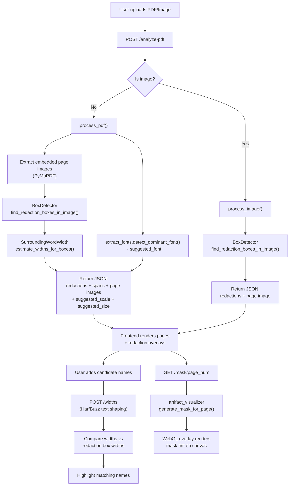

# Epstein Unredactor — Architecture Overview

A Django web application that analyzes scanned PDF documents to detect black redaction bars, measures their pixel widths, and helps users identify which names could fit under each redaction by matching text widths.

## Technology Stack

| Layer | Technology | Purpose |
|-------|-----------|---------|
| **Web framework** | Django 6.0 | URL routing, template rendering, API views |
| **PDF parsing** | PyMuPDF (fitz) | Extract embedded images and text spans from PDFs |
| **Image analysis** | OpenCV + NumPy | Detect black rectangular redaction boxes in page images |
| **Text shaping** | uHarfBuzz (+ Pillow fallback) | Measure precise pixel widths of candidate names accounting for kerning and ligatures |
| **Mask generation** | Pillow + NumPy | Create grayscale mask PNGs marking redacted regions |
| **Frontend rendering** | Vanilla JS, Fabric.js, WebGL | PDF page display, text overlays, GPU-accelerated mask tinting |
| **Production server** | Gunicorn + Nginx | WSGI app server behind a reverse proxy with SSL |

## Directory Structure

```
EpsteinTool/
├── manage.py                       # Django entry point
├── requirements.txt                # Python dependencies
├── setup.sh                        # Production server setup (Linux)
├── run_app.sh / run_app.bat        # Local dev launchers
│
├── epstein_project/                # Django project config
│   ├── settings.py                 # INSTALLED_APPS, STATIC, DB, upload limits
│   ├── urls.py                     # Root URL conf → includes guesser.urls
│   ├── wsgi.py / asgi.py
│
├── guesser/                        # Main Django app
│   ├── views.py                    # API endpoints (analyze-pdf, widths, mask, fonts)
│   ├── urls.py                     # App URL routes
│   │
│   ├── logic/                      # Backend processing modules
│   │   ├── BoxDetector.py          # Row-scan black box detection
│   │   ├── SurroundingWordWidth.py # Refine box edges using nearby text positions
│   │   ├── ProcessRedactions.py    # Orchestrator: PDF → boxes → refined redactions + scale/size detection
│   │   ├── extract_fonts.py        # Dominant font detection; maps PDF font names to .ttf files
│   │   ├── width_calculator.py     # HarfBuzz text width measurement
│   │   └── artifact_visualizer.py  # Grayscale mask PNG generation
│   │
│   ├── templates/guesser/
│   │   └── index.html              # Single-page app (Django template)
│   │
│   └── static/guesser/             # Frontend assets
│       ├── styles.css              # Full CSS design system
│       ├── state.js                # Global state + DOM element cache
│       ├── api.js                  # Candidate management + width matching logic
│       ├── pdf-viewer.js           # File upload, page navigation, redaction overlays
│       ├── ui-events.js            # Zoom, resize, drag, thumbnails
│       ├── app.js                  # Initialization + event wiring
│       ├── text-tool.js            # Fabric.js text overlay tool
│       └── webgl-mask.js           # WebGL mask rendering pipeline
│
├── assets/
│   ├── fonts/                      # .ttf font files for width calculation
│   ├── names/                      # Pre-built candidate name lists
│   └── pdfs/                       # Sample PDF documents
│
├── guide/                          # Documentation (you are here)
└── tests/                          # Test scripts
```

## Data Flow



## Module Dependencies

```mermaid
graph TD
    subgraph "Django Layer"
        views["views.py"]
        urls["urls.py"]
    end

    subgraph "Logic Layer"
        PR["ProcessRedactions.py"]
        BD["BoxDetector.py"]
        SW["SurroundingWordWidth.py"]
        AV["artifact_visualizer.py"]
        WC["width_calculator.py"]
    end

    subgraph "Frontend"
        HTML["index.html"]
        APP["app.js"]
        PDF["pdf-viewer.js"]
        API["api.js"]
        UI["ui-events.js"]
        ST["state.js"]
        TT["text-tool.js"]
        WGL["webgl-mask.js"]
    end

    views --> PR
    views --> WC
    views --> AV
    PR --> BD
    PR --> SW
    AV --> BD
    AV --> PR

    APP --> PDF
    APP --> API
    APP --> UI
    PDF --> API
    PDF --> WGL
    PDF --> TT
    API --> ST
    UI --> ST
