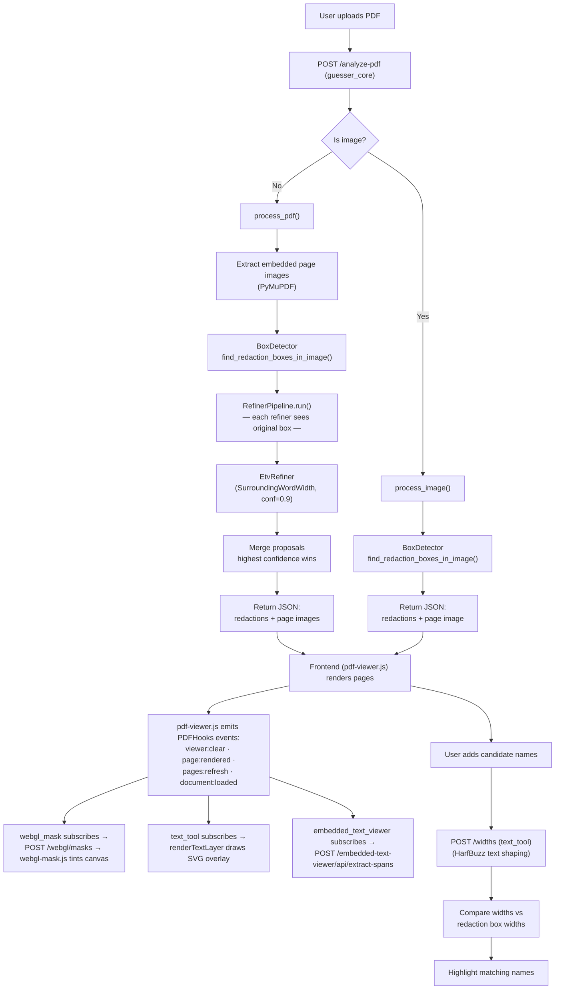

# Epstein Unredactor — Architecture Overview

A Django web application that analyzes scanned PDF documents to detect black redaction bars, measures their pixel widths, and helps users identify which names could fit under each redaction by matching text widths. The project uses a "Core + Plugin" architecture with two complementary registries — a **Python tool registry** (`@register_tool`) for backend/template wiring and a **JavaScript hook bus** (`PDFHooks`) for frontend lifecycle wiring — so features live in independent, individually-removable Django apps.

## Technology Stack

| Layer | Technology | Purpose |
|-------|-----------|---------|
| **Web framework** | Django 6.0 | URL routing, template rendering, API views |
| **PDF parsing** | PyMuPDF (fitz) | Extract embedded images and text spans from PDFs |
| **Image analysis** | OpenCV + NumPy | Detect black rectangular redaction boxes in page images |
| **Refiner pipeline** | Python ABCs + dataclasses | Modular edge-refinement stages that each propose adjustments independently; merged by confidence |
| **Text shaping** | uHarfBuzz (+ Pillow fallback) | Measure precise pixel widths of candidate names accounting for kerning |
| **Mask generation** | Pillow + NumPy | Create grayscale mask PNGs marking redacted regions |
| **Frontend rendering** | Vanilla JS, Fabric.js, WebGL | PDF page display, SVG text overlays, GPU-accelerated mask tinting |
| **Plugin integration** | `PDFHooks` event bus (JS) + `@register_tool` (Python) | Decoupled, by-event plugin wiring on both ends |
| **Production server** | Gunicorn + Nginx | WSGI app server behind a reverse proxy with SSL |

## Directory Structure

```
redaction_light/
├── manage.py                       # Django entry point
├── requirements.txt                # Python dependencies
├── run_app.bat                     # Local dev launcher (Windows)
│
├── epstein_project/                # Django project config
│   ├── settings.py                 # INSTALLED_APPS (core + dynamic plugin discovery)
│   ├── urls.py                     # Auto-discovers routes via registry + AppConfig
│   ├── wsgi.py / asgi.py
│
├── guesser_core/                   # Core App (Base Viewer & Redaction Processing)
│   ├── base.py                     # PDFTool base class (all plugins inherit from this)
│   ├── registry.py                 # PDFToolRegistry + @register_tool decorator
│   ├── views.py                    # Root /, /analyze-pdf, /analyze-default
│   ├── urls.py
│   ├── logic/
│   │   ├── BoxDetector.py          # Row-scan black box detection
│   │   ├── SurroundingWordWidth.py # ETV edge-refinement logic (wrapped by EtvRefiner)
│   │   ├── ProcessRedactions.py    # Orchestrator: PDF → boxes → RefinerPipeline → redactions
│   │   ├── masking.py              # Shared mask-array helpers (used by webgl_mask)
│   │   └── refiners/               # Refiner pipeline package
│   │       ├── base.py             # DetectedBox, BoxProposal dataclasses + RedactionRefiner ABC
│   │       ├── pipeline.py         # RefinerPipeline: independent runs + confidence-based merge
│   │       └── etv_refiner.py      # EtvRefiner — wraps SurroundingWordWidth (confidence=0.9)
│   ├── templates/                  # Base index.html (iterates registry for plugins)
│   └── static/guesser_core/        # Base UI JS: hooks.js (event bus), state.js, pdf-viewer.js,
│                                   #   ui-events.js, app.js, styles.css
│
├── text_tool/                      # Plugin App (Font logic & Typography)
│   ├── tool.py                     # TextTool(PDFTool) — registered via @register_tool
│   ├── apps.py                     # ready() imports tool.py
│   ├── views.py                    # /widths, /fonts-list
│   ├── urls.py
│   ├── logic/
│   │   ├── width_calculator.py     # HarfBuzz width measurement
│   │   └── extract_fonts.py        # Dominant font detection
│   ├── templates/                  # Toolbars injected via registry
│   └── static/text_tool/           # unified-text-box.js, svg-renderer.js, etc.
│
├── webgl_mask/                     # Plugin App (Visual GPU Masks)
│   ├── tool.py                     # WebglMaskTool(PDFTool)
│   ├── apps.py
│   ├── views.py                    # /webgl/masks
│   ├── urls.py
│   ├── logic/
│   │   └── artifact_visualizer.py  # OpenCV -> grayscale mask PNG generator (uses core masking.py)
│   ├── templates/                  # Toolbar button + options bar injected via registry
│   └── static/webgl_mask/          # webgl-mask.js (WebGL renderer), webgl-mask.css
│
├── redaction_matching/             # Plugin App (Name-matching sidebar)
│   ├── tool.py                     # RedactionMatchingTool(PDFTool) — UI only, no routes
│   ├── apps.py
│   ├── templates/                  # sidebar_tools.html, toolbar_button.html
│   └── static/redaction_matching/  # api.js, redaction-matching.js, styles.css
│
├── embedded_text_viewer/           # Plugin App (Self-contained Inline Text Overlay)
│   ├── tool.py                     # EmbeddedTextViewerTool(PDFTool)
│   ├── apps.py
│   ├── views.py                    # /embedded-text-viewer/api/extract-spans
│   ├── urls.py
│   ├── logic/                      # span extraction + width helpers
│   ├── templates/                  # Toolbar link and options bar
│   └── static/embedded_text_viewer/
│       └── etv-fetch.js            # Span fetching & ETV lifecycle (subscribes to PDFHooks)
│
├── extracted_text/                 # Backend-only App (no PDFTool, no UI, no routes)
│   ├── apps.py                     # Pure logic module
│   └── logic/extract.py            # extract_pdf() — imported by embedded_text_viewer.views
│
├── assets/
│   ├── fonts/                      # .ttf font files for width calculation
│   ├── names/                      # Pre-built candidate name lists
│   └── pdfs/                       # Sample PDF documents
│
├── guide/                          # Documentation (you are here)
└── db.sqlite3
```

## Two registries, two directions of decoupling

The project keeps the core ignorant of which plugins exist, on **both** ends of the stack:

| Concern | Mechanism | Who registers | Who consumes |
|---------|-----------|---------------|--------------|
| Backend routes, templates, static, toolbar slots | `@register_tool` on a `PDFTool` subclass (`guesser_core/registry.py`) | each plugin's `tool.py` (imported by its `apps.py` `ready()`) | `epstein_project/urls.py` + `index.html` iterate the registry |
| Frontend runtime lifecycle (page render, document load, zoom, …) | `PDFHooks.on(event, handler)` (`guesser_core/static/guesser_core/hooks.js`) | each plugin's JS at load time | the core viewer emits events with `PDFHooks.emit(...)` |

Because the core **emits events** and **iterates a registry** rather than calling plugin code by name, deleting a plugin folder removes the app, its routes, its templates, its static, and its event subscriptions in one step — with no dangling references left in the core. (See the [Tool Expansion Guide](../tool-expansion-guide.md) for the hook bus contract.)

## Data Flow


```mermaid
flowchart TD
    A["User uploads PDF"] --> B["POST /analyze-pdf (guesser_core)"]
    B --> C{"Is image?"}
    C -->|Yes| D["process_image()"]
    C -->|No| E["process_pdf()"]

    E --> F["Extract embedded page images\n(PyMuPDF)"]
    F --> G["BoxDetector\nfind_redaction_boxes_in_image()"]
    G --> RP["RefinerPipeline.run()\n— each refiner sees original box —"]
    RP --> ETV["EtvRefiner\n(SurroundingWordWidth, conf=0.9)"]
    ETV --> MERGE["Merge proposals\nhighest confidence wins"]
    MERGE --> I["Return JSON:\nredactions + page images"]

    D --> G2["BoxDetector\nfind_redaction_boxes_in_image()"]
    G2 --> I2["Return JSON:\nredactions + page image"]

    I --> J["Frontend (pdf-viewer.js) renders pages"]
    I2 --> J

    J --> HOOK["pdf-viewer.js emits PDFHooks events:\nviewer:clear · page:rendered ·\npages:refresh · document:loaded"]

    HOOK --> O["webgl_mask subscribes →\nPOST /webgl/masks → webgl-mask.js tints canvas"]
    HOOK --> TXT["text_tool subscribes →\nrenderTextLayer draws SVG overlay"]
    HOOK --> ETVJS["embedded_text_viewer subscribes →\nPOST /embedded-text-viewer/api/extract-spans"]

    J --> K["User adds candidate names"]
    K --> L["POST /widths (text_tool)\n(HarfBuzz text shaping)"]
    L --> M["Compare widths vs\nredaction box widths"]
    M --> N["Highlight matching names"]
```

## Module Dependencies


```mermaid
graph TD
    subgraph "Django Project"
        urls["epstein_project/urls.py"]
    end

    subgraph "guesser_core (Core App)"
        REG["registry.py\n@register_tool"]
        BASE["base.py\nPDFTool"]
        HOOKS["hooks.js\nPDFHooks bus"]
        PR["ProcessRedactions.py"]
        BD["BoxDetector.py"]
        SW["SurroundingWordWidth.py"]
        MASK["masking.py"]
        core_views["views.py"]
        HTML["index.html"]
        APP["app.js / pdf-viewer.js / ui-events.js"]
        subgraph "refiners/"
            RF_BASE["base.py\nDetectedBox · BoxProposal\nRedactionRefiner ABC"]
            RF_PIPE["pipeline.py\nRefinerPipeline"]
            RF_ETV["etv_refiner.py\nEtvRefiner"]
        end
    end

    subgraph "webgl_mask (Plugin)"
        WGL_TOOL["tool.py\nWebglMaskTool"]
        WGL_V["views.py"]
        AV["artifact_visualizer.py"]
        WGL_JS["webgl-mask.js"]
    end

    subgraph "text_tool (Plugin)"
        TXT_TOOL["tool.py\nTextTool"]
        TXT_V["views.py"]
        WC["width_calculator.py"]
        TXT_JS["svg-renderer.js"]
    end

    subgraph "redaction_matching (Plugin)"
        RM_TOOL["tool.py\nRedactionMatchingTool"]
        RM_JS["api.js"]
    end

    subgraph "embedded_text_viewer (Plugin)"
        ETV_TOOL["tool.py\nEmbeddedTextViewerTool"]
        ETV_V["views.py"]
        ETV_JS["etv-fetch.js"]
        ET_LOGIC["extracted_text.logic.extract"]
    end

    %% Backend registration flow
    BASE -.->|"inherits"| WGL_TOOL
    BASE -.->|"inherits"| TXT_TOOL
    BASE -.->|"inherits"| RM_TOOL
    BASE -.->|"inherits"| ETV_TOOL
    WGL_TOOL -->|"@register_tool"| REG
    TXT_TOOL -->|"@register_tool"| REG
    RM_TOOL -->|"@register_tool"| REG
    ETV_TOOL -->|"@register_tool"| REG

    %% Frontend hook subscriptions (core emits, plugins subscribe)
    APP -->|"emit()"| HOOKS
    HOOKS -.->|"on()"| WGL_JS
    HOOKS -.->|"on()"| TXT_JS
    HOOKS -.->|"on()"| ETV_JS

    %% URL routing
    urls -->|"registry"| REG
    urls --> core_views

    %% Core dependencies
    core_views --> PR
    PR --> BD
    PR --> RF_PIPE
    RF_PIPE --> RF_BASE
    RF_ETV --> SW
    RF_ETV --> RF_BASE
    core_views -->|"get_tools()"| REG
    HTML -.->|"iterates registry"| REG

    %% Plugin backends
    WGL_V --> AV
    AV -->|"uses"| MASK
    AV -.->|"reads from core"| BD
    TXT_V --> WC
    ETV_V --> ET_LOGIC
```

## Refiner Pipeline

Redaction boxes are refined by `RefinerPipeline` (`guesser_core/logic/refiners/pipeline.py`), which runs all registered refiners **independently against the original detected box** and then merges their proposals edge-by-edge.

### Merge strategy

For each edge (left / right) independently:
1. Collect all non-`None` proposals from refiners.
2. Pick the proposal with the **highest confidence**.
3. On a confidence tie, prefer the **less aggressive** shrink (left edge stays leftmost; right edge stays rightmost).
4. Safety bound: a proposal can only shrink the box, never expand it beyond the original detected extent.

### Registered refiners (`/analyze-pdf`)

| Refiner | Confidence | Evidence | What it does |
|---------|-----------|----------|--------------|
| `EtvRefiner` | 0.9 | `fitz.Page`, image rect + dims | Finds words before/after box in embedded PDF text; measures space width; rejects proposals that change box width by >25% |

The pipeline is built in `ProcessRedactions.py` as `_etv_pipeline = RefinerPipeline([EtvRefiner()])`.

### Adding a new refiner

1. Create a class anywhere that inherits `RedactionRefiner` from `guesser_core/logic/refiners/base.py`.
2. Implement `refine(box: DetectedBox, evidence: Any) -> BoxProposal`.
3. Add an instance to the pipeline list in `guesser_core/logic/ProcessRedactions.py` and supply its evidence in the `evidence_map` passed to `pipeline.run()`.

No changes to `base.py`, `pipeline.py`, or existing refiners are needed.

## Frontend plugin integration — the `PDFHooks` bus

`guesser_core/static/guesser_core/hooks.js` defines `window.PDFHooks` (`on` / `off` / `emit`). It is loaded **first**, before any other script. The core viewer emits lifecycle events; plugins subscribe. Handlers may be async (`emit` awaits them in registration order) and a throwing handler never breaks the core or other plugins.

| Event | Emitted by | Payload | Example subscriber |
|-------|-----------|---------|--------------------|
| `ui:ready` | `app.js` (end of init) | — | `webgl_mask` wires its mask-toggle button |
| `viewer:clear` | `pdf-viewer.js` (`goToPage`) | — | `webgl_mask` tears down GL contexts |
| `page:rendered` | `pdf-viewer.js` (`goToPage`) | `{ pageContainer, pageNum }` | `webgl_mask` adds its overlay canvas; `text_tool` draws the SVG layer |
| `pages:refresh` | `pdf-viewer.js` (`goToPage`) | — | `webgl_mask` re-syncs visible mask canvases |
| `document:loaded` | `pdf-viewer.js` (`loadDocument`) | `{ file, isDefault }` | `webgl_mask` fetches masks; `embedded_text_viewer` fetches spans |
| `zoom:changed` | `ui-events.js` (`updateCSSZoom`) | `{ zoom }` | (available for plugins that need zoom-aware redraws) |

The core never calls a plugin function by name and owns no plugin DOM. Plugins that contribute a subtoolbar register their toggle button with `window.registerSubtoolbar(button)` so the generic `openSubtoolbar` can manage it without naming the plugin.
