# Redaction Processing — Backend Logic

This folder documents the five Python modules in `guesser/logic/` that handle PDF analysis, redaction detection, width refinement, mask generation, and text measurement.

## Module Pipeline

```mermaid
flowchart LR
    PDF["PDF Bytes"] --> PR["ProcessRedactions"]
    PR --> BD["BoxDetector"]
    PR --> SW["SurroundingWordWidth"]
    PDF --> AV["artifact_visualizer"]
    AV --> BD
    WC["width_calculator"] -.- PR

    style BD fill:#2d333b,stroke:#8ab4f8
    style SW fill:#2d333b,stroke:#f28b82
    style PR fill:#2d333b,stroke:#81c995
    style AV fill:#2d333b,stroke:#fdd663
    style WC fill:#2d333b,stroke:#c58af9
```

## Module Reference

| Module | Main Functions | Description |
|--------|---------------|-------------|
| [BoxDetector](BoxDetector_Documentation.md) | `find_redaction_boxes_in_image()` | Row-scan detection of black rectangular boxes |
| [SurroundingWordWidth](SurroundingWordWidth_documentation.md) | `estimate_widths_for_boxes()` | Refine box edges using positions of nearby words |
| [ProcessRedactions](process_redactions_docs.md) | `process_pdf()`, `process_image()`, `extract_page_image_bytes()` | Orchestrator: coordinates detection + refinement, returns JSON |
| [artifact_visualizer](artifact_visualizer_documentation.md) | `generate_mask_for_page()`, `create_redaction_masks()` | Generates grayscale mask PNGs for WebGL overlay |
| [width_calculator](width_calculator_documentation.md) | `get_text_widths()`, `get_available_fonts()` | HarfBuzz text shaping for candidate name width measurement |

## Processing Order

1. **Receive** PDF or image bytes from the Django view
2. **Extract** embedded page images from PDF using PyMuPDF (`extract_page_image_bytes`)
3. **Detect** black rectangular boxes in each image (`BoxDetector`)
4. **Refine** box edges by measuring gaps to surrounding text words (`SurroundingWordWidth`)
5. **Return** structured JSON with redaction coordinates, text spans, and base64 page images
6. **On demand:** Generate grayscale mask PNGs for individual pages (`artifact_visualizer`)
7. **On demand:** Measure pixel widths of candidate names using HarfBuzz (`width_calculator`)
