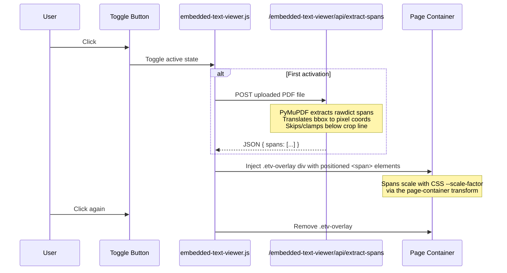

# Embedded Text Viewer Implementation

The `embedded_text_viewer` is a Django plugin app that renders all embedded PDF text spans as a visual overlay directly on top of the main viewer's page canvas. It makes any text hidden under redaction boxes visible by drawing it in blue at its original coordinates.

## Features

- **Integrated Overlay:** Renders natively inside the main `guesser_core` viewer — no separate page or window required.
- **Toggle Button:** A toolbar icon (`document_scanner`) activates/deactivates the overlay without leaving the current view.
- **Pixel-Perfect Coordinate Translation:** Converts PyMuPDF's PDF-point coordinates into the 816×1056 cropped-image pixel space used by the core viewer, accounting for the bottom crop applied to taller pages.

## Architecture

The plugin follows the standard EpsteinTool "toolbar button + overlay" pattern used by `webgl_mask` and `text_tool`:



## Coordinate Translation

The core viewer pages are rendered at 816×1056 px (standard US Letter at ~133% scale). The embedded page images are cropped to this aspect ratio. The backend translates each text span's bounding box like so:

1. **Find the image placement rect** (`img_rect`) via `page.get_image_rects(xref)`
2. **Compute scale factors:** `scale_x = img_pixel_width / img_rect.width`  
3. **Translate:** `px_x = (bbox.x0 - img_rect.x0) * scale_x`
4. **Crop boundary:** `expected_h = img_w * (1056 / 816)` — spans below this line are discarded

## Endpoints

| Method | Path | Description |
|--------|------|-------------|
| `POST` | `/embedded-text-viewer/api/extract-spans` | Accepts a PDF file upload (`file`). Returns JSON with a `spans` array. |

### Response Format

```json
{
  "spans": [
    {
      "page": 1,
      "text": "IN THE CIRCUIT COURT",
      "x": 245.33,
      "y": 112.67,
      "w": 326.00,
      "h": 16.00,
      "fontSize": 16.00,
      "font": "TimesNewRomanPSMT"
    }
  ]
}
```

## Files

```
embedded_text_viewer/
├── views.py                         # extract_spans endpoint
├── urls.py                          # api/extract-spans route
├── templates/embedded_text_viewer/
│   └── toolbar_button.html          # Toggle button injected into toolbar
└── static/embedded_text_viewer/
    ├── embedded-text-viewer.js      # Frontend overlay logic
    └── styles.css                   # Overlay positioning & text styles
```
